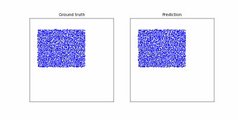

## Learning to Simulate Complex Physics with Graph Networks in pytorch geometric
Minimal pytorch+pytorch geometric version of https://arxiv.org/abs/2002.09405 and https://github.com/deepmind/deepmind-research/tree/master/learning_to_simulate

Result of 425k steps of training:

## Datasets
Datasets are available to download via:

Download the dataset and place the metadata.json and .tfrecord file in the "data" folder

* Metadata file with dataset information (sequence length, dimensionality, box bounds, default connectivity radius, statistics for normalization, ...):

  `https://storage.googleapis.com/learning-to-simulate-complex-physics/Datasets/{DATASET_NAME}/metadata.json`

* TFRecords containing data for all trajectories (particle types, positions, global context, ...):

  `https://storage.googleapis.com/learning-to-simulate-complex-physics/Datasets/{DATASET_NAME}/{DATASET_SPLIT}.tfrecord`

Where:

* `{DATASET_SPLIT}` is one of:
  * `train`
  * `valid`
  * `test`

* `{DATASET_NAME}` one of the datasets following the naming used in the paper:
  * `WaterDrop`
  * `Water`
  * `Sand`
  * `Goop`
  * `MultiMaterial`
  * `RandomFloor`
  * `WaterRamps`
  * `SandRamps`
  * `FluidShake`
  * `FluidShakeBox`
  * `Continuous`
  * `WaterDrop-XL`
  * `Water-3D`
  * `Sand-3D`
  * `Goop-3D`

To get started do: 
`https://storage.googleapis.com/learning-to-simulate-complex-physics/Datasets/WaterDrop/metadata.json`
`https://storage.googleapis.com/learning-to-simulate-complex-physics/Datasets/WaterDrop/train.tfrecord`

After downloading a dataset, run train_or_infer.py
This should create a "rollout" which contains "rollout_0.pkl" file. This will contain the simulated trajectory.

To see the contents of this trajectory do:
python -m render_rollout --rollout_path=rollouts/rollout_0.pkl